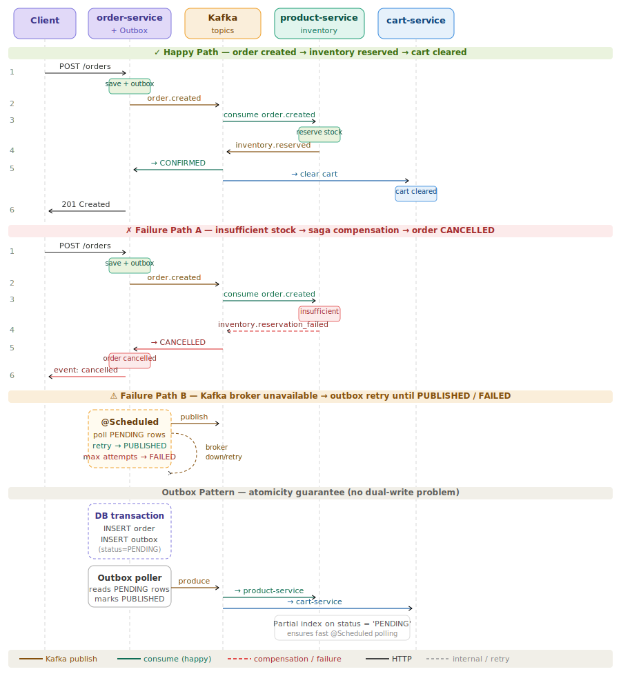

# Online Mart

A microservices-based e-commerce backend built with **Spring Boot**, demonstrating production patterns including Kafka-based Saga choreography, the Outbox pattern, OpenFeign inter-service communication, and a Spring Cloud Gateway API layer.

---

## Table of Contents

- [Architecture Overview](#architecture-overview)
- [Services](#services)
- [Features](#features)
- [Kafka Event Flows](#kafka-event-flows)
- [Technology Stack](#technology-stack)
- [Project Structure](#project-structure)
- [Setup & Running](#setup--running)
  - [Without Docker (local dev)](#without-docker-local-dev)
  - [With Docker Compose](#with-docker-compose)
- [API Reference](#api-reference)
- [Running Tests](#running-tests)

---

## Architecture Overview

```
Client
  │
  ▼
api-gateway  (Spring Cloud Gateway — port 8080)
  │
  ├──▶ product-service  (port 8081)   PostgreSQL: mart_product
  ├──▶ order-service    (port 8082)   PostgreSQL: mart_order
  └──▶ cart-service     (port 8083)   PostgreSQL: mart_cart

Async messaging: Apache Kafka (KRaft, port 9092)
Inter-service HTTP: OpenFeign (order-service → cart-service)
```

All services share a single PostgreSQL instance with separate databases per service. Routing is handled by hardcoded gateway rules — no service registry (Eureka) required.

---

## Services

### api-gateway
Spring Cloud Gateway with hardcoded routes. Routes all `/products/**`, `/orders/**`, and `/cart/**` traffic to the appropriate downstream service.

### product-service
Manages the product catalogue and inventory. Consumes `order.created` Kafka events to reserve stock, and publishes `inventory.reserved` or `inventory.reservation_failed` in response.

### order-service
Handles order lifecycle. On order creation it:
1. Fetches cart items via OpenFeign (cart-service)
2. Persists the order with status `PENDING`
3. Writes an outbox record atomically in the same DB transaction
4. Transitions to `CONFIRMED` or `CANCELLED` based on downstream Kafka events

### cart-service
Manages per-user shopping carts. Exposes cart data to order-service via Feign, and consumes `inventory.reserved` to clear the cart after a successful order.

---

## Features

| Feature | Details |
|---|---|
| **REST APIs** | Full CRUD for products, carts, orders |
| **Browse / Search API** | `POST /browse` on all services — filterable, sortable, paginated using `JpaSpecificationExecutor` and `BrowseHelper` |
| **OpenFeign** | order-service fetches cart items from cart-service at order creation time |
| **Kafka Saga choreography** | Distributed transaction spanning order → product → cart with no central coordinator |
| **Outbox pattern** | Atomic event publishing: order + outbox row written in one DB transaction; `@Scheduled` poller publishes to Kafka and marks `PUBLISHED` / `FAILED` |
| **Partial index** | PostgreSQL partial index on `outbox.status = 'PENDING'` for efficient polling |
| **Saga compensation** | `inventory.reservation_failed` triggers order cancellation — cart is not cleared |
| **Spring Cloud Gateway** | Single entry point, hardcoded routes, no Eureka |
| **Multi-module Maven** | Parent POM with shared dependency management |
| **Docker Compose** | Full stack: Kafka (KRaft), PostgreSQL, all four services |
| **Unit tests** | JUnit 5 + Mockito across all service layers, `@Nested` groups, `ArgumentCaptor`, `InOrder` verification |

---

## Kafka Event Flows



### Topics

| Topic | Producer | Consumers |
|---|---|---|
| `order.created` | order-service (outbox poller) | product-service |
| `inventory.reserved` | product-service | order-service, cart-service |
| `inventory.reservation_failed` | product-service | order-service |

### Happy Path

```
Client → POST /orders
  order-service: save order(PENDING) + outbox(PENDING) [single DB tx]
  Outbox poller → publish order.created → Kafka
  product-service: consume order.created → reserve stock
  product-service → publish inventory.reserved → Kafka
  order-service: consume inventory.reserved → order status = CONFIRMED
  cart-service:  consume inventory.reserved → cart cleared
Client ← 201 Created (async confirmation via event)
```

### Failure Path A — Insufficient Stock (Saga Compensation)

```
... same up to product-service ...
  product-service: stock check fails
  product-service → publish inventory.reservation_failed → Kafka
  order-service: consume inventory.reservation_failed → order status = CANCELLED
  (cart is NOT cleared — compensation complete)
```

### Failure Path B — Kafka Broker Down (Outbox Retry)

```
  order-service: order + outbox row saved (PENDING) — HTTP response already returned
  Outbox poller: broker unavailable → retry on next @Scheduled tick
  On success: outbox row marked PUBLISHED
  After max retries: outbox row marked FAILED (requires manual intervention / alerting)
```

The Outbox pattern ensures **no dual-write**: if the DB transaction fails, no event is ever published. If the broker is temporarily unavailable, the event is retried without data loss.

---

## Technology Stack

| Layer | Technology |
|---|---|
| Language | Java 17 |
| Framework | Spring Boot 3.x |
| API Gateway | Spring Cloud Gateway |
| Messaging | Apache Kafka (KRaft — no Zookeeper) |
| Inter-service HTTP | Spring Cloud OpenFeign |
| Persistence | Spring Data JPA, Hibernate |
| Database | PostgreSQL 15 |
| Build | Maven (multi-module) |
| Containerisation | Docker, Docker Compose |
| Testing | JUnit 5, Mockito |

---

## Project Structure

```
online-mart/
├── pom.xml                        # Parent POM — dependency management
├── api-gateway/
│   ├── pom.xml
│   └── src/main/
│       ├── java/com/onlinemart/gateway/
│       └── resources/application.properties
├── product-service/
│   ├── pom.xml
│   ├── Dockerfile
│   └── src/
│       ├── main/java/com/onlinemart/product/
│       │   ├── controller/
│       │   ├── service/
│       │   ├── repository/
│       │   ├── entity/
│       │   ├── dto/
│       │   ├── mapper/
│       │   ├── kafka/          # KafkaConsumer, KafkaProducer
│       │   └── spec/           # BrowseHelper, JpaSpecification
│       └── test/
├── order-service/
│   ├── pom.xml
│   ├── Dockerfile
│   └── src/
│       ├── main/java/com/onlinemart/order/
│       │   ├── controller/
│       │   ├── service/
│       │   ├── repository/
│       │   ├── entity/         # Order, OutboxEvent
│       │   ├── dto/
│       │   ├── mapper/
│       │   ├── kafka/          # OutboxPoller (@Scheduled), KafkaConsumer
│       │   ├── feign/          # CartServiceClient
│       │   └── spec/
│       └── test/
├── cart-service/
│   ├── pom.xml
│   ├── Dockerfile
│   └── src/
│       ├── main/java/com/onlinemart/cart/
│       │   ├── controller/
│       │   ├── service/
│       │   ├── repository/
│       │   ├── entity/
│       │   ├── dto/
│       │   ├── mapper/
│       │   ├── kafka/
│       │   └── spec/
│       └── test/
├── docker-compose.yml
├── init-db/
│   └── init-db.sql             # Creates mart_product, mart_order, mart_cart databases
└── docs/
    └── kafka-event-flow.svg
```

---

## Setup & Running

### Prerequisites

| Tool | Version |
|---|---|
| Java | 17+ |
| Maven | 3.9+ |
| PostgreSQL | 15+ (local setup only) |
| Apache Kafka | 3.x KRaft mode (local setup only) |
| Docker & Docker Compose | 24+ (Docker setup only) |

---

### Without Docker (local dev)

#### 1. Start PostgreSQL

```bash
# macOS (Homebrew)
brew services start postgresql@15

# Create databases
psql -U postgres -c "CREATE DATABASE mart_product;"
psql -U postgres -c "CREATE DATABASE mart_order;"
psql -U postgres -c "CREATE DATABASE mart_cart;"
```

#### 2. Start Kafka (KRaft — no Zookeeper)

```bash
# macOS (Homebrew) — Kafka installed at /opt/homebrew
export KAFKA_HOME=/opt/homebrew/opt/kafka

# Format storage (first time only)
$KAFKA_HOME/bin/kafka-storage.sh format \
  -t $($KAFKA_HOME/bin/kafka-storage.sh random-uuid) \
  -c $KAFKA_HOME/libexec/config/kraft/server.properties

# Start broker
$KAFKA_HOME/bin/kafka-server-start.sh \
  $KAFKA_HOME/libexec/config/kraft/server.properties
```

#### 3. Create Kafka topics

```bash
$KAFKA_HOME/bin/kafka-topics.sh --create \
  --bootstrap-server localhost:9092 \
  --replication-factor 1 --partitions 1 \
  --topic order.created

$KAFKA_HOME/bin/kafka-topics.sh --create \
  --bootstrap-server localhost:9092 \
  --replication-factor 1 --partitions 1 \
  --topic inventory.reserved

$KAFKA_HOME/bin/kafka-topics.sh --create \
  --bootstrap-server localhost:9092 \
  --replication-factor 1 --partitions 1 \
  --topic inventory.reservation_failed
```

#### 4. Build all services

```bash
# From the project root
mvn clean install -DskipTests
```

#### 5. Run services

Open four terminals (or use your IDE):

```bash
# Terminal 1 — product-service
cd product-service
mvn spring-boot:run

# Terminal 2 — order-service
cd order-service
mvn spring-boot:run

# Terminal 3 — cart-service
cd cart-service
mvn spring-boot:run

# Terminal 4 — api-gateway
cd api-gateway
mvn spring-boot:run
```

Default ports: `api-gateway=8080`, `product-service=8081`, `order-service=8082`, `cart-service=8083`

---

### With Docker Compose

#### 1. Build service JARs

```bash
# From the project root — build all modules
mvn clean package -DskipTests
```

#### 2. Build and start the full stack

```bash
docker compose up --build
```

This starts:
- `postgres` — shared PostgreSQL instance, databases initialised via `init-db/init-db.sql`
- `kafka` — single-node Kafka in KRaft mode
- `product-service`, `order-service`, `cart-service`, `api-gateway`

#### 3. Stop the stack

```bash
docker compose down

# To also remove volumes (wipes database data)
docker compose down -v
```

#### Rebuild a single service

```bash
# Rebuild only order-service without stopping others
mvn -pl order-service package -DskipTests
docker compose up --build order-service
```

---

## API Reference

All requests go through the gateway at `http://localhost:8080`.

### Products

| Method | Path | Description |
|---|---|---|
| `GET` | `/products` | List all products |
| `GET` | `/products/{id}` | Get product by ID |
| `POST` | `/products` | Create product |
| `PUT` | `/products/{id}` | Update product |
| `DELETE` | `/products/{id}` | Delete product |
| `POST` | `/products/browse` | Filter / sort / paginate |

### Cart

| Method | Path | Description |
|---|---|---|
| `GET` | `/cart/{userId}` | Get cart for user |
| `POST` | `/cart/{userId}/items` | Add item to cart |
| `DELETE` | `/cart/{userId}/items/{itemId}` | Remove item |
| `DELETE` | `/cart/{userId}` | Clear cart |
| `POST` | `/cart/browse` | Filter / sort / paginate |

### Orders

| Method | Path | Description |
|---|---|---|
| `GET` | `/orders` | List all orders |
| `GET` | `/orders/{id}` | Get order by ID |
| `POST` | `/orders` | Create order (triggers Saga) |
| `POST` | `/orders/browse` | Filter / sort / paginate |

### Browse API request body

```json
{
  "filters": [
    { "field": "status", "operator": "eq", "value": "CONFIRMED" }
  ],
  "sort": { "field": "createdAt", "direction": "DESC" },
  "page": 0,
  "size": 20
}
```

Response envelope:

```json
{
  "content": [...],
  "page": 0,
  "size": 20,
  "totalElements": 42,
  "totalPages": 3
}
```

---

## Running Tests

```bash
# Run all tests across all modules
mvn test

# Run tests for a single service
mvn -pl order-service test

# Run with verbose output
mvn test -pl product-service -Dsurefire.useFile=false

# Run a specific test class
mvn -pl cart-service test -Dtest=CartServiceTest
```

Test coverage includes:
- Service layer: `@Nested` groups per method, `ArgumentCaptor` for Kafka producer verification, `InOrder` for Saga sequencing
- Kafka: producer and consumer mocked via Mockito
- Feign client: mocked at service layer boundary
